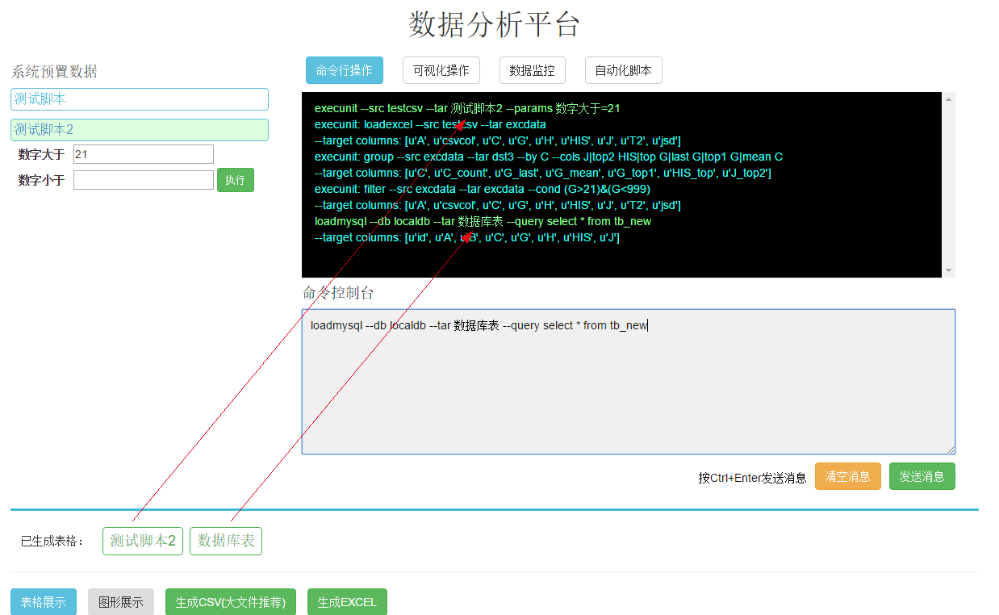
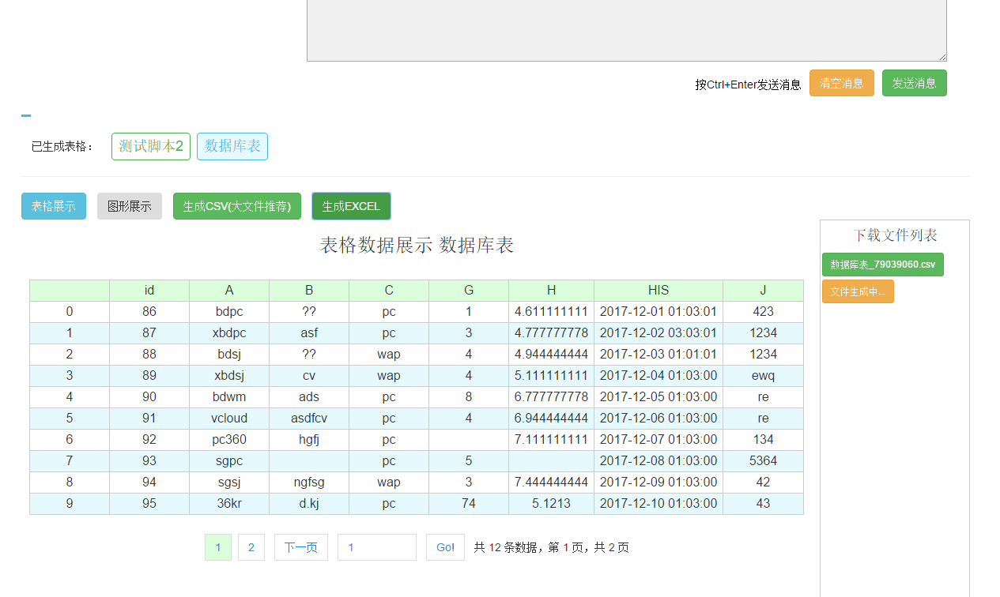
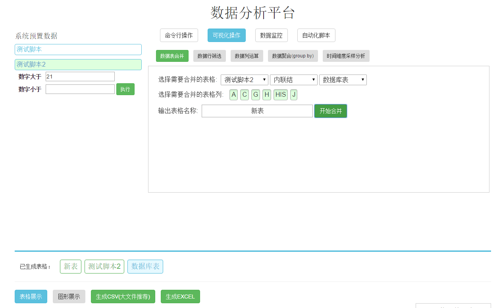
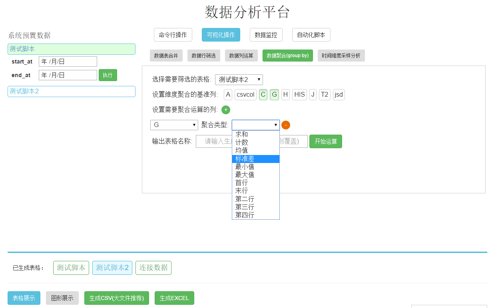
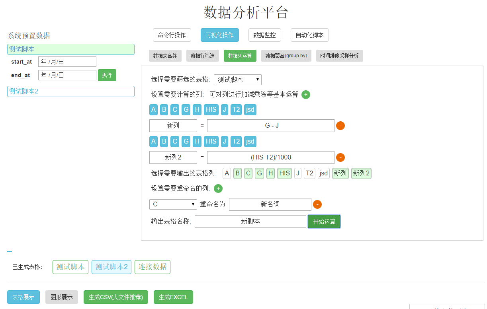

## 介绍
### 数据分析平台是做什么的？
- 亿级以内数据分析及处理，如多表合并、数据聚合、最小二乘回归等等
    - 亿级以上数据分析则该平台不适用，请使用Spark/Hive
    - 万级以内单表数据分析，本系统有些重了，推荐使用excel
    - 涉及中等级别的数据分析处理，且不了解python/R语言的同学，或者熟悉python/R，但希望更好的管理自己的数据分析脚本，**欢迎使用本套工具**
    - **推荐阅读[别老扯什么Hadoop了，你的数据根本不够大](http://geek.csdn.net/news/detail/2780)**
- 跨源数据的整合与分析
    - 用什么方式可以像使用mysql的join语句那么简单，但可以连接多个mysql库、连接mysql数据与excel数据、连接mongo数据与redis数据...呢？
    - 如何既能够连接多表数据，但又不太需要考虑性能问题呢？(众所周知，mysql同库尽管可以使用join语法，但在数据量达百万级以上就会有严重性能问题)
- 自由可定制的数据定时任务与监控分析
    - 依赖于简洁易懂的命令行语法，以及python numpy/pandas在数据分析方面强大功能，本系统对这两个库的一些常用方法做了封装及方法扩展，保证一项需要花费几个小时的业务监控编程任务，可在一小时以内通过命令行脚本配置固化完成

## 安装部署
### 环境配置及库安装
- 数据处理库环境安装
    - linux 环境需对mysql做环境依赖，debian为例：
        - apt-get install libxml2-dev libxslt1-dev python-dev libmysqlclient-dev libsqlite3-dev
    - pip install numpy pandas openpyxl mysql-python sqlalchemy
- web后台环境安装
    - pip install django channels redis asgi_redis django_redis_sessions
- web前端环境安装
    - npm install
    - npm run dev

### 初始化部署
- 本地命令方式（直接命令行操作，无需web服务）
    - **该方式可直接用于配置了环境的linux服务器上，做定时脚本或其他模块功能**
    - 依赖文件夹： datalib/shell (testdata仅为测试而创建)
    - 具体操作1(文件脚本代理)：
        - 进入shell文件目录
        - 修改settings.py文件，主要为数据库配置
        - 编写相应的配置文件，如test.data
        - 命令行执行： python analyse_file.py -f test.data
    - 具体操作2(直接更改python文件)：
        - 进入shell文件目录
        - 修改settings.py文件，主要为数据库配置
        - 编写相应的脚本文件，如analyse_rawtext.py
        - 命令行执行： python analyse_rawtext.py
- 本地部署方式（开启web服务）
    - **该方式需要搭建web服务，用户可直接通过浏览器访问操作，使用成本较低**
    - 更改配置文件
        - 将main文件夹中的settings_test.py文件重命名为settings.py
            - 按需更改相应配置，可参考django开发文档
        - 将datasettings文件夹中的settings_test.py文件重命名为settings.py
            - 按需更改相应数据库配置
    - 测试环境初始化部署：
        - 开启redis服务 可在main文件的settings.py中做相应配置
            - 注意django-channels库对redis的版本要求是在2.8及以上
            - [Windows 版本Redis 下载地址](https://github.com/MSOpenTech/redis/releases)
            - [Linux 版本Redis 下载地址](https://redis.io/download)
        - python manage.py makemigrations app
        - python manage.py migrate
        - python manage.py createsuperuser / test / tt111111
    - 测试环境运行
        - 运行方法1：
            - python manage.py runserver 0.0.0.0:8000
        - 运行方法2：
            - daphne main.asgi:channel_layer -b 0.0.0.0 -p 8000
            - python manage.py runworker
        - 访问localhost:8000  帐号：test tt111111

### 数据分析引擎操作命令
- shell脚本配置文件及web服务的自动化配置均采用命令行完成
    - 命令行语义化明晰，诸如从在配置文件中被命名为test_db的数据库中，获取一份数据，再从被命名为test_db2的数据库获取一份数据，先对两份数据做合并，然后对该数据做筛选和排序后，以某列做聚合。操作如下：
        1. loadmysql --db test_db --tar 源数据表1 --query select * from tb_table;
        2. loadmysql --db test_db2 --tar 源数据表2 --query select * from tb_other;
        3. merge --src 源数据表1 源数据表2 --tar 中间数据表 --join inner 列1
        4. filter --src 中间数据表 --tar 中间数据表 --cond (列1>4) & ((列2<"2015-10-01") | (列2>"2016-11-01")) --sort 列1 asc, 列2 desc
        5. group --src 中间数据表 --tar 目标数据表 --by 列1 列2 --cols 列3|sum 列3|count 列4|min
        6. savecsv --src 目标数据表 --tar 输出文件.csv
    - 详细命令行使用参见[数据分析引擎命令接口](README_COMMAND.md)

## 自定义开发
### 常用配置选项
- 命令行脚本模式
    - 命令行脚本模式适用于诸如linux服务器定时任务或者临时任务，如crontab定时发邮件、数据库同步与迁移等
        - 详细操作参见[数据分析命令行接口](shell/README.md)
- WEB 服务模式
    - 数据库及参数配置：
        - 配置文件地址： datasettings/settings.py
        - 配置方法参见[数据分析WEB接口](datasettings/README.md)
    - WEB操作界面选项配置：
        - 数据执行脚本文件：datasettings/execunit/**.data
            - 自定义参数语法：
                - 文件头设置 $set key val
                - 命令行中使用 ${key}，解析器会自动用val替换${key}
                - 替换方式如C语言中的 #define key val 的用法
            - 命令行语法参见 [数据分析引擎命令接口](README_COMMAND.md)
        - 界面选项配置： datasettings/presets.py
            - 配置文件为json形式，参数如下：
                - name: 选择数据的名称
                - desc：数据描述
                - file：用于数据分析的数据脚本名称，固定目录在datasettings/execunit
                - perm: 该数据可供应的权限，不填则为全部拥有权限
                - params: 选择数据的可选参数，与*.data文件配套使用
                - params: 格式为数组，第一项为参数名，第二项为参数类型，用于前端的input[type]，第三项为补充参数类型，如select框的选择，至少填一项

### 二次开发-目录结构
- 数据分析引擎
    - datalib  核心数据处理引擎
        - databaseaccess  数据获取及输出层
        - datamultioperate  多数据合并层
        - datasingleoperate  单数据筛选及操作层
        - test_*.py  测试文件
- 独立执行脚本
    - shell  可直接脚本执行数据分析示例
    - testdata  直接进行脚本执行的测试数据与配置
- 可视化web工程
    - main  后端工程主入口及环境配置
    - app  后端服务主目录
        - 标准 python django框架开发
            - django 参考：https://docs.djangoproject.com/en/1.10/
        - 采用websocket跟前端进行命令通讯，采用channels框架
            - channels 参考：http://channels.readthedocs.io/en/stable/
        - routings websocket长连接侦听
            - service - msg_agent/runcmds 命令事件代理
        - urls http请求路由
        - views http请求管理
        - models 数据库ORM结构化配置
        - admin django 自带管理后台配置
    - webapp  前端工程主目录
        - build webpack/babel/postcss配置目录，不建议更改
        - dist  命令：npm run dev生成的目标js/css文件地址
        - res  图片等静态资源文件夹
        - src 项目前端开发主文件夹
            - css 采用了postcss规范编写
            - js  采用了vue + vuex + vue-router框架，标准es6/7写法 vue框架参考https://cn.vuejs.org/
                - api 常用js模块
                - components  vue组件
                - entry 项目js入口，vue-router在此配置
                - modules  vue模块
                - store  vuex事件代理
                    * vuex 项目结构参考：http://vuex.vuejs.org/zh-cn/
        - templates  html 模板文件地址

### 工程运行展示
- 

- 

- 

- 

- 
